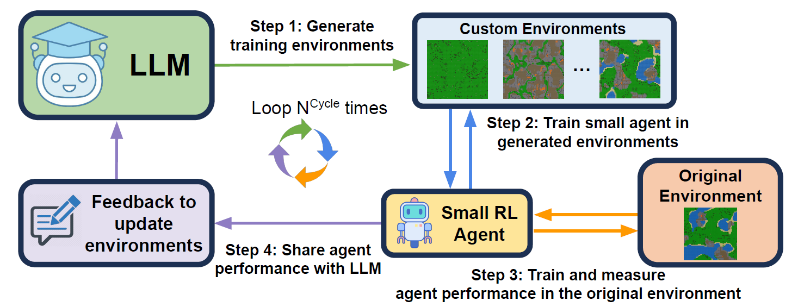

# EnvGen: Generating and Adapting Environments via LLMs for Training Embodied Agents
Official Code Repository for **EnvGen**: Generating and Adapting Environments via LLMs for Training Embodied Agents


[](https://arxiv.org/abs/2403.12014) [](https://envgen-llm.github.io/)


[Abhay Zala*](https://aszala.com/),
[Jaemin Cho*](https://j-min.io),
[Han Lin](https://hl-hanlin.github.io/),
[Jaehong Yoon](https://jaehong31.github.io),
[Mohit Bansal](https://www.cs.unc.edu/~mbansal/)

<br>

<br>
<br>

We propose EnvGen, a novel framework where an LLM adaptively generates training environments to teach smaller embodied RL agents. We aim to generate environments that can create various conditions (e.g., have different terrains or some sub-goals are already achieved) so that agents can learn different skills in parallel and obtain more frequent rewards for challenging long-horizon tasks than in the original environment.


## Code Release Todo List
- [x] LLM environment generation code
- [x] Crafter environment with support for LLM configurations
- [ ] PPO model training code (not required to use our framework, feel free to test your own models with our framework)


# Setup Instructions
### Create Conda Environment
```bash
conda create --name envgen python=3.10
conda activate envgen
```

### Install Requirements
```bash
pip install --upgrade "setuptools==65.7.0" "wheel==0.38.4"
pip install -r requirements.txt
```

### Install our version of Crafter
To allow for integration of LLM controllable parameters, we have made some modifications to the original Crafter codebase.
To install our version of Crafter, run the following commands: 
```bash
cd crafter/
pip install -e .
cd ..
```

# Create Env file (if planning to use an OpenAI based LLM)
Create a file named `.env` and paste the following information into it:
```env
API_KEY=...
API_VERSION=... # optional
API_TYPE=... # optional 
API_BASE=... # optional
```
Then replace the `...`'s with your own OpenAI API key and other information.

<h1 id="Environment-Generation">Environment Generation</h1>

Note this codebase assumes you are using an OpenAI LLM, however, EnvGen can work with any LLM, you would just need to replace OpenAI code parts with your the other LLM's implementation.

To generate an environment run the following command:
```bash
bash scripts/generate_environment.sh
```
By default, this script will generate an environment configuration file in `./environment_generation/generated_environments/` but you can adjust this via `--save_path`
We use GPT-4-Turbo by default, but you can replace this with `--engine {name of model}`.

## Visualization
If you want to visualize what the LLM-generated environments look you can run the following:
```bash
bash scripts/visualize_environments.sh --config_path {path to the configuration file}
```
e.g., `bash scripts/visualize_environments.sh --config_path ./environment_generation/generated_environments/llm_environments.json`

## Environment Loading
To create Crafter<sup>EnvGen</sup> environments, you just need to load in the configuration file and pass it into the Crafter Env.

For example:
```python
from stable_baselines3.common.vec_env.subproc_vec_env import SubprocVecEnv
from crafter.env import Env
import json
import numpy as np

configuration_file = "..." # path to the generated LLM configuration file
configuration = json.load(open(configuration_file))[0]

# Creates 8 environments for the RL training
env_fns = [
        partial(Env,
                seed=np.random.randint(0, 2**31 - 1),
                world_kwargs=param["environment_settings"],
                initial_inventory=param["inventory_settings"]
        )
        for i in range(8)
]

venv = SubprocVecEnv(env_fns)
```
The only difference from creating a normal Crafter environment vs Crafter<sup>EnvGen</sup> environment is the two optional parameters (`world_kwargs` and `initial_inventory`).
See the example (including some preprocessing) in `env_loader.py`.

Note, by default, our Crafter implementation returns a Python `dict` object with an `image` key, but you can adjust this to directly output images by adding `out_type="image"` to the `Env` object's arguments.

## Adaptive Environments
To use the adaptive environments you just need to run your agent in inference mode (at least 2 times) and save the results somewhere labled `..../stage_X/eval_N`,
where X is any multiple of 2 (e.g., 2, 4, 6, 8, etc.) and N is the run number (e.g., 1, 2, 3, etc.).

For example, if this is my first time I am using adaptive environments, then I save the results into `..../stage_2/eval_N`.
Then if I want to test the agent 2 times (make sure to use the real Crafter environment for testing, not Crafter<sup>EnvGen</sup>), then the runs will be saved under `..../stage_2/eval_1` and `..../stage_2/eval_2`.
Then when I want to do the adaptive environments again, I save the results to `..../stage_4/` and so on.
If you do not want to save the LLM context between each adaptive run then you can just repeatedly overwrite `..../stage_2/` without incrementing the number.

The results should be saved in a JSON format like (and saved with the name `success_rate_final.json`):
```json
{
        "collect_coal": 100,
        "collect_diamond": 0,
        ...
}
```
with each the success rate of each achievement in Crafter (see the Crafter [data file](crafter/crafter/data.yaml) for the achievement list).

Example results directoy would look like:
```
results/
- experiment_name/
-- stage_2/
---- eval_1/
----- success_rate_final.json
---- eval_2/
----- success_rate_final.json
...
```
An example is provided in `example/dummy_experiment/`

To generate the new environments run this command:
```bash
bash scripts/update_environments.sh --load_path {....} --save_name {name of your experiment} --stage X --params_file {...} --num_evals N
```
where `load_path` is the path to `stage_N` directories, `params_file` is the path to the very first LLM environment configuration file, `X` is the stage which you evaluated, and `N` is the number of evaluations.

Then you can train your agent using the new configurations. 

Here is an example command you can run (make sure to first run the environment generation command [above](#Environment-Generation)):
```bash
bash scripts/update_environments.sh --load_path ./example/dummy_experiment --save_name dummy_experiment --stage 2 --params_file ./environment_generation/generated_environments/llm_environments.json --num_evals 3
```
This will produce `environment_generation/generated_environments/dummy_experiment/stage_2/` with the new environments.

# Citation
```bibtex
@inproceedings{Zala2024EnvGen,
        author    = {Abhay Zala* and Jaemin Cho* and Han Lin and Jaehong Yoon and Mohit Bansal},
        title     = {EnvGen: Generating and Adapting Environments via LLMs for Training Embodied Agents},
        year      = {2024},
        booktitle = {COLM},
}
```

# Thanks
Thanks to Danijar Hafner for the original Crafter [codebase](https://github.com/danijar/crafter)!
